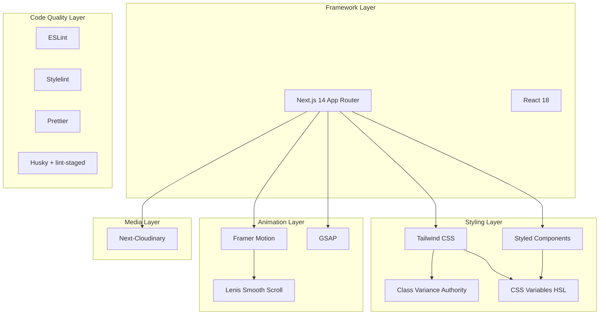

# ADR Generation - Luis Carlos Portfolio (Fork Dennis Snellenberg)

## Contexto do Projeto

Este projeto e um **fork do portfolio Dennis Snellenberg**, criado por **Luis Carlos** em **Novembro 2024** com o objetivo de reutilizar a arquitetura, estilizacao e boas praticas do projeto original como base para um novo portfolio pessoal.

## Resumo da Analise

Apos analise completa do repositorio, identifiquei **12 decisoes arquiteturais** herdadas do projeto original e adotadas neste fork. Todas estao claramente refletidas nos arquivos do projeto e servirao como base para futuras melhorias.

## Arquitetura Geral do Projeto



## ADRs a Serem Gerados

### ADR-001 - Framework: Next.js 14 com App Router

- **Evidencia**: [`next.config.js`](next.config.js), [`package.json`](package.json), estrutura `/app`
- **Decisao**: Uso do App Router (pasta `app/`) em vez de Pages Router

### ADR-002 - Estilizacao Hibrida: Tailwind CSS + Styled Components

- **Evidencia**: [`tailwind.config.js`](tailwind.config.js), [`app/_providers/styled-components/index.jsx`](app/_providers/styled-components/index.jsx)
- **Decisao**: Combinacao de utility-first CSS com CSS-in-JS para casos complexos

### ADR-003 - Sistema de Design Tokens via CSS Variables

- **Evidencia**: [`app/_lib/plugins/tailwind.js`](app/_lib/plugins/tailwind.js), [`app/_providers/styled-components/theme.js`](app/_providers/styled-components/theme.js)
- **Decisao**: Tokens de cor em HSL para consistencia entre Tailwind e Styled Components

### ADR-004 - Animacoes: Framer Motion como Principal + GSAP para Casos Especificos

- **Evidencia**: [`app/_layout/transition/index.jsx`](app/_layout/transition/index.jsx), [`app/_hooks/use-follow-pointer.js`](app/_hooks/use-follow-pointer.js)
- **Decisao**: Framer Motion para animacoes declarativas, GSAP para animacoes imperativas de alto desempenho

### ADR-005 - Scroll Suave via Lenis

- **Evidencia**: [`app/_hooks/use-lenis.js`](app/_hooks/use-lenis.js)
- **Decisao**: Studio Freight Lenis para smooth scrolling nativo

### ADR-006 - Gerenciamento de Midia via Next-Cloudinary

- **Evidencia**: [`app/_layout/project/slider.jsx`](app/_layout/project/slider.jsx), [`app/_data/project-options.js`](app/_data/project-options.js)
- **Decisao**: Cloudinary como CDN de imagens/videos com otimizacao automatica

### ADR-007 - Tipografia: Font Local Customizada

- **Evidencia**: [`app/_fonts/neue-montreal/index.js`](app/_fonts/neue-montreal/index.js)
- **Decisao**: Font Neue Montreal hospedada localmente com next/font

### ADR-008 - Organizacao de Pastas com Prefixo Underscore

- **Evidencia**: Estrutura `app/_components`, `app/_hooks`, `app/_layout`, etc.
- **Decisao**: Convencao underscore para separar codigo de infra das rotas

### ADR-009 - Utilitario de Classes: CVA + clsx + tailwind-merge

- **Evidencia**: [`app/_utils/helpers/class-name.js`](app/_utils/helpers/class-name.js), [`app/_components/common/button/magnetic/index.variance.js`](app/_components/common/button/magnetic/index.variance.js)
- **Decisao**: Composicao de classes com type-safety e resolucao de conflitos

### ADR-010 - Tipagem via JSDoc em vez de TypeScript

- **Evidencia**: [`jsconfig.json`](jsconfig.json), anotacoes JSDoc nos arquivos `.jsx`
- **Decisao**: Manter JavaScript com tipagem via comentarios JSDoc

### ADR-011 - Qualidade de Codigo: ESLint + Stylelint + Prettier + Husky

- **Evidencia**: [`.eslintrc.json`](.eslintrc.json), [`.stylelintrc.json`](.stylelintrc.json), [`package.json`](package.json)
- **Decisao**: Pipeline de linting completo com pre-commit hooks

### ADR-012 - Package Manager: pnpm

- **Evidencia**: [`pnpm-lock.yaml`](pnpm-lock.yaml)
- **Decisao**: pnpm como gerenciador de pacotes

---

## Local de Saida

Os ADRs serao criados em uma nova pasta `docs/adr/` com a seguinte estrutura:

```
docs/
  adr/
    README.md                              # Indice dos ADRs + contexto do fork
    ADR-001-nextjs-14-app-router.md
    ADR-002-estilizacao-hibrida.md
    ADR-003-design-tokens-css-variables.md
    ADR-004-animacoes-framer-motion-gsap.md
    ADR-005-scroll-suave-lenis.md
    ADR-006-midia-cloudinary.md
    ADR-007-tipografia-font-local.md
    ADR-008-organizacao-pastas-underscore.md
    ADR-009-utilitario-classes-cva.md
    ADR-010-tipagem-jsdoc.md
    ADR-011-qualidade-codigo-linting.md
    ADR-012-package-manager-pnpm.md
```

O README.md incluira:

- Informacoes sobre o autor (Luis Carlos)
- Contexto do fork (baseado no Dennis Snellenberg Portfolio)
- Data de criacao (Novembro 2024)
- Indice de todos os ADRs
- Instrucoes para criar novos ADRs

## Formato de Cada ADR

Cada arquivo seguira o template padrao:

- **Autor:** Luis Carlos
- **Status:** Aceito (Herdado do projeto original)
- **Data:** Novembro 2024 (data do fork)
- **Origem:** Decisao herdada do portfolio Dennis Snellenberg
- Contexto, Decisao, Alternativas Consideradas, Consequencias

## Proximo Passo

Apos gerar os ADRs documentando o estado atual, sera possivel:

1. Identificar pontos de melhoria na arquitetura
2. Criar novos ADRs para decisoes futuras (ex: migracao para TypeScript, novo sistema de autenticacao, etc.)
3. Manter historico claro das evolucoes do projeto
