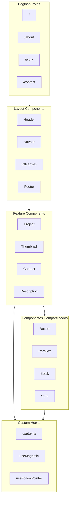

# Documentacao de Arquitetura do Projeto

## Objetivo

Criar o arquivo `docs/ARCHITECTURE.md` com documentacao clara e concisa da arquitetura do portfolio, cobrindo os 4 pontos solicitados:

1. Organizacao por features/paginas
2. Estrategia de componentes
3. Gerenciamento de estado
4. Navegacao

---

## Estrutura do Documento

### 1. Organizacao do Projeto

Documentar a estrategia de organizacao de pastas usando:

- **Prefixo underscore (`_`)** para codigo de infraestrutura (nao-rotas)
  - `_components/` - componentes reutilizaveis
  - `_layout/` - componentes de layout/secoes
  - `_hooks/` - custom hooks
  - `_providers/` - context providers
  - `_utils/` - utilitarios
  - `_data/` - dados estaticos
  - `_config/` - configuracoes
  - `_fonts/` - fontes locais
  - `_lib/` - bibliotecas/plugins

- **Route groups `()`** para organizar rotas
  - `(in-progress)/` - paginas em desenvolvimento

- **Arquivos de rota**: `page.jsx`, `layout.jsx`, `not-found.jsx`

Referencia: [ADR-008](docs/adr/ADR-008-organizacao-pastas-underscore.md)

---

### 2. Estrategia de Componentes

Documentar a hierarquia de componentes:

```
Componentes Reutilizaveis (_components/)
├── common/          # UI genericos (button, magnetic)
├── parallax/        # Efeitos de parallax (fade, reveal, slider)
├── stack/           # Layout utilities (center, overlay)
├── svg/             # Icones SVG
└── in-progress/     # Placeholder para paginas WIP

Componentes de Layout (_layout/)
├── header/          # Cabecalho com animacoes
├── navbar/          # Navegacao (brand, list)
├── offcanvas/       # Menu mobile (toggle, body, links)
├── contact/         # Secao de contato
├── description/     # Secao de descricao
├── project/         # Secao de projetos
├── thumbnail/       # Grid de thumbnails
└── transition/      # Transicoes de pagina (preloader)
```

**Padroes de arquivos**:

- `index.jsx` - componente principal
- `index.styled.js` - estilos Styled Components
- `variants.js` - variantes Framer Motion
- `index.js` (pasta) - barrel exports

Referencia: [ADR-002](docs/adr/ADR-002-estilizacao-hibrida.md)

---

### 3. Gerenciamento de Estado

Documentar a **ausencia de estado global** e a estrategia de hooks locais:

**Sem Redux/Context global** - o projeto usa:

- **Estado local** via `useState`/`useRef` nos componentes
- **Custom hooks** para logica reutilizavel:
  - `use-dimensions` - dimensoes de elementos
  - `use-follow-pointer` - cursor customizado
  - `use-magnetic` - efeito magnetico
  - `use-lenis` - scroll suave
  - `use-offcanvas-toggle` - menu mobile
  - `use-contact-slider` / `use-project-slider` / `use-parallax-slider` - sliders
  - `use-time-out` - timeouts controlados

**Por que nao ha estado global?**

- Portfolio estatico sem autenticacao
- Sem dados dinamicos do servidor
- Interacoes localizadas por secao

---

### 4. Navegacao

Documentar o sistema de navegacao:

- **App Router (Next.js 14)** - file-based routing
- **Rotas disponiveis**:
  - `/` - Home (page.jsx)
  - `/about` - (in-progress)
  - `/work` - (in-progress)
  - `/contact` - (in-progress)
  - `*` - 404 (not-found.jsx)

- **Componentes de navegacao**:
  - `Navbar` - barra superior com brand e links
  - `Offcanvas` - menu lateral mobile
  - Links definidos em `_data/nav-items.js`

- **Transicoes de pagina**: via `_layout/transition/` com Framer Motion

Referencia: [ADR-001](docs/adr/ADR-001-nextjs-14-app-router.md)

---

## Diagrama de Arquitetura

Incluir diagrama visual da estrutura de camadas:



---

## Arquivo de Destino

- **Caminho**: `docs/ARCHITECTURE.md`
- **Formato**: Markdown com diagramas Mermaid
- **Idioma**: Portugues (seguindo padrao dos outros docs)
