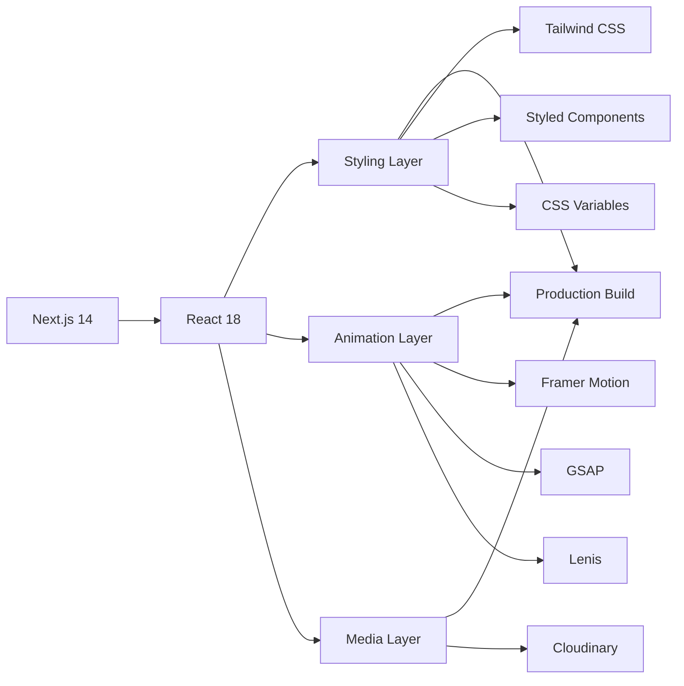

<div align="center">

# Luis Carlos Portfolio

### Modern Portfolio with Hybrid Architecture

<p>
  <strong>Next.js 14</strong> • <strong>Hybrid Styling</strong> (Tailwind + Styled Components) • <strong>Dual Animations</strong> (Framer Motion + GSAP)
</p>

<p>

&nbsp;
&nbsp;
&nbsp;
&nbsp;
&nbsp;


</p>

<p>

[Tech Stack](#-tech-stack) •
[Why This Portfolio](#-why-this-portfolio) •
[Demo](#-demo) •
[Features](#-features) •
[Getting Started](#-getting-started) •
[Documentation](#-documentation) •
[CI/CD](#-cicd) •
[Contributing](#-contributing)

</p>


</div>

---

## 🏗️ Tech Stack

A modern web application built with a carefully selected technology stack:



### Core Technologies

| Layer | Technologies | Purpose |
|-------|-------------|---------|
| **Framework** | Next.js 14 + React 18 | App Router, Server Components, RSC |
| **Styling** | Tailwind CSS + Styled Components + CVA | Hybrid approach: utility + dynamic CSS-in-JS |
| **Animation** | Framer Motion + GSAP + Lenis | Dual system: declarative + imperative animations |
| **Media** | Next Cloudinary | Optimized image/video delivery with transformations |
| **Type Safety** | JSDoc | Type checking without TypeScript overhead |
| **Package Manager** | PNPM | Fast, disk-efficient, workspace protocol |
| **Quality** | ESLint + Stylelint + Prettier + Husky | Comprehensive linting and formatting |

### Development Tools


---

## ✨ Why This Portfolio?

### Unique Architecture Decisions

This portfolio stands out through thoughtful architectural choices, each documented in Architecture Decision Records (ADRs):

#### 🎨 **Hybrid Styling System**
- **Tailwind CSS** for utility classes and rapid layout
- **Styled Components** for dynamic, component-scoped styles
- **CSS Variables** as design tokens shared across both systems
- **CVA** (Class Variance Authority) for type-safe component variants

*Benefits: Best of both worlds - utility-first speed + CSS-in-JS flexibility*

#### ⚡ **Dual Animation System**
- **Framer Motion** for declarative, React-friendly animations (page transitions, component entry/exit)
- **GSAP** for imperative, high-performance animations (cursor follow, complex timelines)
- **Lenis** for smooth, momentum-based scrolling

*Benefits: Right tool for each animation type - performance + developer experience*

#### 🏛️ **Design Tokens Architecture**
- Centralized CSS Variables in `app/_layout/theme-provider.jsx`
- Shared between Tailwind config and Styled Components
- Single source of truth for colors, spacing, typography

*Benefits: Consistent theming, easy customization, DRY principles*

#### 📝 **Documentation-First Approach**
- **12 Architecture Decision Records** documenting every major technical choice
- Comprehensive documentation in `docs/` covering architecture, UI/UX, CI/CD
- Folder structure documentation with rationale for underscore prefixes

*Benefits: Maintainability, knowledge transfer, onboarding clarity*

#### 🚀 **Production-Grade CI/CD**
- Automated quality checks on every PR (ESLint, Stylelint, Prettier)
- Preview deployments for visual validation
- Production deployments with zero downtime
- Dependabot for automated dependency updates

*Benefits: Code quality enforcement, faster feedback loops, reliable deployments*

---

## ✨ Demo

You can visit and explore the live portfolio at:

🔗 **[luiscarlosvn-portfolio.vercel.app](https://luiscarlosvn-portfolio.vercel.app/)**

---

## 🔥 Features

### User Experience
- ⚡ **Lightning Fast** - Optimized Next.js 14 with App Router
- 🎨 **Smooth Animations** - Page transitions with Framer Motion
- 🖱️ **Custom Cursor** - GSAP-powered cursor follow effect
- 📱 **Fully Responsive** - Mobile-first design approach
- 🌊 **Smooth Scrolling** - Lenis momentum scrolling
- 📸 **Optimized Media** - Cloudinary image/video optimization

### Developer Experience
- 🏗️ **Modern Architecture** - Next.js 14 App Router with RSC
- 🎭 **Hybrid Styling** - Tailwind + Styled Components + CVA
- 📐 **Design System** - CSS Variables as design tokens
- 📝 **Type Safety** - JSDoc annotations throughout
- 🧪 **Quality Gates** - ESLint, Stylelint, Prettier, Husky
- 📦 **PNPM** - Fast and efficient package management
- 🤖 **GitHub Actions** - Automated CI/CD pipelines
- 📚 **Comprehensive Docs** - 12 ADRs + architecture documentation

### Code Quality
- ✅ Linting with ESLint (JavaScript/JSX)
- ✅ Linting with Stylelint (CSS/Styled Components)
- ✅ Formatting with Prettier
- ✅ Pre-commit hooks with Husky + lint-staged
- ✅ Conventional Commits enforcement
- ✅ PR templates and issue templates

---

## 📃 Pages

| Route | Page | Description |
|-------|------|-------------|
| `/` | **Home** | Hero section with introduction and featured work |
| `/about` | **About** | Personal information, skills, and experience |
| `/work` | **Work** | Portfolio projects showcase |
| `/contact` | **Contact** | Contact form and social links |
| `*` | **404** | Custom not found page |

<p align="right">(<a href="#top">BACK TO TOP 🔝</a>)</p>

---

## 🚀 Getting Started

### Prerequisites

Ensure you have the following installed:

- **Node.js** 18.x or 20.x (recommended: 20.11.0 as per `.nvmrc`)
- **PNPM** 8.x (`npm install -g pnpm`)
- **Git**

### Quick Start

```bash
# 1. Clone the repository
git clone https://github.com/LuisCarlos01/dennis-snellenberg-portfolio.git
cd dennis-snellenberg-portfolio

# 2. Install dependencies
pnpm install

# 3. Set up environment variables
cp .env.example .env.local
# Edit .env.local with your Cloudinary credentials

# 4. Start development server
pnpm dev
```

Open [http://localhost:3000](http://localhost:3000) in your browser 🎉

### Environment Variables

This project requires environment variables for Cloudinary integration. See [`.env.example`](.env.example) for required variables.

For detailed setup instructions, see [`docs/ci-cd-setup/ENVIRONMENT-VARIABLES.md`](docs/ci-cd-setup/ENVIRONMENT-VARIABLES.md).

### Build for Production

```bash
# Build optimized production bundle
pnpm build

# Start production server locally
pnpm start
```

### Scripts

| Command | Description |
|---------|-------------|
| `pnpm dev` | Start development server |
| `pnpm build` | Build production bundle |
| `pnpm start` | Start production server |
| `pnpm lint` | Run ESLint |
| `pnpm lint:fix` | Fix ESLint issues automatically |

### Troubleshooting

**Port already in use?**
```bash
# Kill process on port 3000
npx kill-port 3000
```

**Module not found after pulling?**
```bash
# Clean install dependencies
rm -rf node_modules .next
pnpm install
```

**Cloudinary images not loading?**
- Check your `.env.local` has correct `NEXT_PUBLIC_CLOUDINARY_CLOUD_NAME`
- Verify images exist in your Cloudinary account

<p align="right">(<a href="#top">BACK TO TOP 🔝</a>)</p>

---

## 📚 Documentation

This project maintains comprehensive documentation for architecture, decisions, and processes:

```
docs/
├── 🏗️  arquitetura/
│   └── ARCHITECTURE.md           # System architecture overview
├── 📝  adr/                       # Architecture Decision Records
│   ├── ADR-001-nextjs-14-app-router.md
│   ├── ADR-002-estilizacao-hibrida.md
│   ├── ADR-003-design-tokens-css-variables.md
│   ├── ADR-004-animacoes-framer-motion-gsap.md
│   ├── ADR-005-scroll-suave-lenis.md
│   ├── ADR-006-midia-cloudinary.md
│   ├── ADR-007-tipografia-font-local.md
│   ├── ADR-008-organizacao-pastas-underscore.md
│   ├── ADR-009-utilitario-classes-cva.md
│   ├── ADR-010-tipagem-jsdoc.md
│   ├── ADR-011-qualidade-codigo-linting.md
│   └── ADR-012-package-manager-pnpm.md
├── 🗺️  mapa-pastas/
│   └── FOLDER-MAP.md             # Project structure explanation
├── 🎨  ui-ux/
│   └── UI-UX.md                  # Design system and UX guidelines
├── 🚀  ci-cd-setup/
│   ├── CI-CD-SETUP.md            # CI/CD pipeline documentation
│   ├── ENVIRONMENT-VARIABLES.md  # Environment setup guide
│   ├── GITHUB-SECRETS.md         # GitHub secrets configuration
│   └── PRODUCTION-CHECKLIST.md   # Pre-deployment checklist
└── 📋  briefing/
    └── BRIEFING.md               # Project briefing and overview
```

### Key Documentation

- **[Architecture Overview](docs/arquitetura/ARCHITECTURE.md)** - System design and technical decisions
- **[ADR Index](docs/adr/README.md)** - All architecture decision records
- **[Folder Structure](docs/mapa-pastas/FOLDER-MAP.md)** - Project organization explained
- **[UI/UX Guidelines](docs/ui-ux/UI-UX.md)** - Design system documentation
- **[CI/CD Setup](docs/ci-cd-setup/CI-CD-SETUP.md)** - Complete deployment guide

<p align="right">(<a href="#top">BACK TO TOP 🔝</a>)</p>

---

## 🔄 CI/CD

This project uses **GitHub Actions** for continuous integration and deployment to Vercel.

### Workflows

#### 🧪 CI Pipeline ([`.github/workflows/ci.yml`](.github/workflows/ci.yml))

Runs on every push and pull request:

- **Quality Checks**: ESLint, Stylelint, Prettier validation
- **Build Validation**: Production build test
- **Multi-version Testing**: Node.js 18.x and 20.x

#### 🚀 CD Pipeline ([`.github/workflows/cd.yml`](.github/workflows/cd.yml))

Automated deployments:

- **Preview Deployments**: Every PR gets a unique preview URL
- **Production Deployment**: Automatic deploy on merge to `main`
- **Vercel Integration**: Uses Vercel CLI for zero-downtime deployments

### Setting Up CI/CD for Your Fork

For detailed setup instructions, see the complete guide at [`docs/ci-cd-setup/CI-CD-SETUP.md`](docs/ci-cd-setup/CI-CD-SETUP.md).

**Quick Setup:**

1. Configure GitHub Secrets (see [`docs/ci-cd-setup/GITHUB-SECRETS.md`](docs/ci-cd-setup/GITHUB-SECRETS.md))
2. Link your Vercel project
3. Enable branch protection rules
4. Configure Dependabot (already set up in `.github/dependabot.yml`)

### Branch Protection

Recommended settings for `main` branch:

- ✅ Require pull request before merging
- ✅ Require status checks to pass: `Quality Checks`, `Build Validation`
- ✅ Require conversation resolution before merging
- ✅ Require linear history

<p align="right">(<a href="#top">BACK TO TOP 🔝</a>)</p>

---

## 🤝 Contributing

Contributions are what make the open source community such an amazing place to learn, inspire, and create. Any contributions you make are **greatly appreciated**!

### How to Contribute

1. **Fork** the project
2. **Create** your feature branch
   ```bash
   git checkout -b feature/AmazingFeature
   ```
3. **Commit** your changes using [Conventional Commits](https://www.conventionalcommits.org/)
   ```bash
   git commit -m "feat: add some amazing feature"
   ```
4. **Push** to your branch
   ```bash
   git push origin feature/AmazingFeature
   ```
5. **Open** a Pull Request (use the [PR template](.github/pull_request_template.md))
6. **Wait** for CI checks to pass (ESLint, Stylelint, build validation)
7. **Request** review from maintainers

### Commit Message Convention

This project follows [Conventional Commits](https://www.conventionalcommits.org/):

| Type | Description | Example |
|------|-------------|---------|
| `feat:` | New feature | `feat: add dark mode toggle` |
| `fix:` | Bug fix | `fix: resolve mobile menu overflow` |
| `docs:` | Documentation only | `docs: update README installation steps` |
| `style:` | Code style (formatting, etc.) | `style: format with prettier` |
| `refactor:` | Code refactoring | `refactor: extract header component` |
| `perf:` | Performance improvements | `perf: optimize image loading` |
| `test:` | Adding/updating tests | `test: add unit tests for utils` |
| `chore:` | Maintenance tasks | `chore: update dependencies` |

### Pull Request Guidelines

- PRs automatically trigger CI checks and preview deployments
- All checks must pass before merging
- Keep PRs focused and small for easier review
- Update documentation if needed
- Add screenshots for UI changes

<p align="right">(<a href="#top">BACK TO TOP 🔝</a>)</p>

---

## 🔗 Connect

<p align="left">
  <a href="https://github.com/LuisCarlos01">
    
  </a>
  <a href="https://www.linkedin.com/in/luiscarlosvn">
    
  </a>
  <a href="https://luiscarlosvn-portfolio.vercel.app">
    
  </a>
</p>

---

## 📄 License

This project is open source and available under the **MIT License**.

---

## 🙏 Acknowledgments

This portfolio is inspired by the exceptional design work of [**Dennis Snellenberg**](https://dennissnellenberg.com/).

Original template created by [**Ali Bagheri**](https://github.com/AliBagheri2079/dennis-snellenberg-portfolio).

Adapted and enhanced by [**Luis Carlos**](https://github.com/LuisCarlos01) with architectural improvements and comprehensive documentation.

---

## 💝 Support This Project

If you find this project helpful or inspiring:

- ⭐ **Star** this repository
- 🍴 **Fork** it for your own use
- 🐛 **Report** bugs or suggest features via [Issues](https://github.com/LuisCarlos01/dennis-snellenberg-portfolio/issues)
- 🔀 **Contribute** via Pull Requests
- 📢 **Share** it with others

Your support helps keep this project maintained and improved! ❤️

<p align="right">(<a href="#top">BACK TO TOP 🔝</a>)</p>

---

<div align="center">

**Built with ❤️ using Next.js, React, and modern web technologies**


</div>
