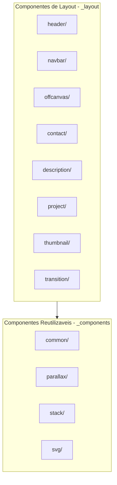
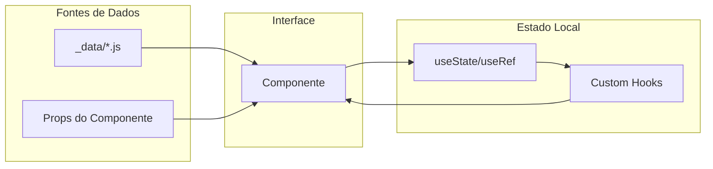
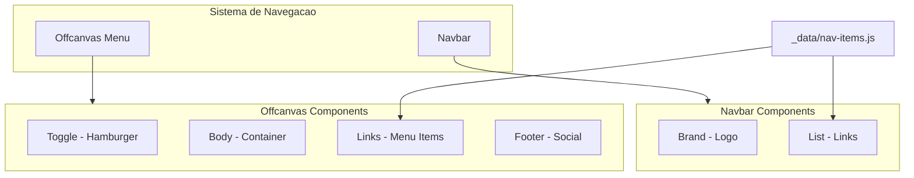
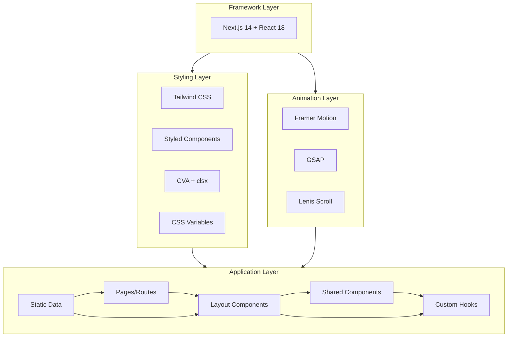

# Arquitetura do Projeto

## Visão Geral

Este documento descreve a arquitetura do portfolio, incluindo organização de pastas, estratégia de componentes, gerenciamento de estado e navegação.

---

## 1. Organização do Projeto

O projeto segue uma organização híbrida que separa claramente código de infraestrutura das rotas do Next.js.

### Estrutura de Pastas

```
app/
├── _components/      # Componentes reutilizáveis
├── _config/          # Configurações (metadata, etc.)
├── _data/            # Dados estáticos (nav-items, social-medias)
├── _fonts/           # Fontes locais (Neue Montreal)
├── _hooks/           # Custom hooks
├── _layout/          # Componentes de layout/seções
├── _lib/             # Bibliotecas e plugins
├── _providers/       # Context providers (Styled Components, Balancer)
├── _utils/           # Funções utilitárias
├── (in-progress)/    # Route group para páginas em desenvolvimento
│   ├── about/
│   ├── contact/
│   └── work/
├── layout.jsx        # Layout raiz
├── page.jsx          # Página inicial (/)
├── not-found.jsx     # Página 404
└── globals.css       # Estilos globais
```

### Convenções

| Prefixo | Significado | Exemplo |
|---------|-------------|---------|
| `_` | Pasta privada (não é rota) | `_components/`, `_hooks/` |
| `()` | Route group (agrupa rotas sem afetar URL) | `(in-progress)/` |
| Nenhum | Rota pública | `page.jsx` → `/` |

### Path Aliases

Imports simplificados via `jsconfig.json`:

```javascript
import { Button } from '@/components';  // → app/_components/index.js
import { useMagnetic } from '@/hooks';  // → app/_hooks/index.js
import { Header } from '@/layout';      // → app/_layout/index.js
```

> **Referência:** [ADR-008 — Organização de Pastas](adr/ADR-008-organizacao-pastas-underscore.md)

---

## 2. Estratégia de Componentes

### Hierarquia de Componentes



### Componentes Reutilizáveis (`_components/`)

| Pasta | Propósito | Componentes |
|-------|-----------|-------------|
| `common/` | UI genéricos | Button, Magnetic |
| `parallax/` | Efeitos de parallax | Fade, Reveal, Slider |
| `stack/` | Layout utilities | Center, Overlay |
| `svg/` | Ícones SVG | SVG wrapper |
| `in-progress/` | Placeholder WIP | InProgress |

### Componentes de Layout (`_layout/`)

| Pasta | Propósito | Subcomponentes |
|-------|-----------|----------------|
| `header/` | Cabeçalho animado | - |
| `navbar/` | Navegação principal | Brand, List |
| `offcanvas/` | Menu mobile | Toggle, Body, Links, Footer |
| `contact/` | Seção de contato | SocialInfo, UserDetails |
| `description/` | Seção de descrição | - |
| `project/` | Seção de projetos | Slider |
| `thumbnail/` | Grid de thumbnails | Action, Cursor, Label, List, Modal |
| `transition/` | Transições de página | Preloader |

### Padrões de Arquivos

Cada componente segue uma estrutura consistente:

```
component/
├── index.jsx          # Componente principal
├── index.styled.js    # Estilos (Styled Components)
├── variants.js        # Variantes de animação (Framer Motion)
└── components/        # Subcomponentes (se houver)
    └── index.js       # Barrel exports
```

### Convenções de Nomenclatura

- **Arquivos**: kebab-case (`use-magnetic.js`)
- **Componentes**: PascalCase (`MagneticButton`)
- **Hooks**: camelCase com prefixo `use` (`useMagnetic`)
- **Styled**: sufixo `.styled.js` (`index.styled.js`)
- **Variantes**: arquivo `variants.js` para Framer Motion

> **Referência:** [ADR-002 — Estilização Híbrida](adr/ADR-002-estilizacao-hibrida.md)

---

## 3. Gerenciamento de Estado

### Estratégia: Estado Local + Custom Hooks

O projeto **não utiliza estado global** (Redux, Zustand, Context API para estado). Em vez disso, adota uma abordagem de estado localizado.

### Por que não há estado global?

| Característica | Implicação |
|----------------|------------|
| Portfolio estático | Não há autenticação ou sessão de usuário |
| Sem dados dinâmicos | Conteúdo definido em `_data/` |
| Interações isoladas | Cada seção gerencia seu próprio estado |

### Custom Hooks (`_hooks/`)

| Hook | Propósito | Estado Gerenciado |
|------|-----------|-------------------|
| `use-dimensions` | Dimensões de elementos | `{ width, height }` |
| `use-follow-pointer` | Cursor customizado | `{ x, y }` |
| `use-magnetic` | Efeito magnético em botões | `{ x, y }` |
| `use-lenis` | Scroll suave | Instância Lenis |
| `use-offcanvas-toggle` | Menu mobile | `isOpen: boolean` |
| `use-contact-slider` | Slider de contato | `activeIndex: number` |
| `use-project-slider` | Slider de projetos | `activeIndex: number` |
| `use-parallax-slider` | Slider parallax | `activeIndex: number` |
| `use-time-out` | Timeouts controlados | `isComplete: boolean` |

### Providers (`_providers/`)

Os providers existentes não são para estado de aplicação, mas para funcionalidades técnicas:

```jsx
<Providers>
  <StyledComponentsRegistry>  {/* SSR para Styled Components */}
    <BalancerProvider>        {/* Balanceamento de texto */}
      {children}
    </BalancerProvider>
  </StyledComponentsRegistry>
</Providers>
```

### Fluxo de Dados



---

## 4. Navegação

### Sistema de Rotas

O projeto utiliza o **App Router** do Next.js 14 com roteamento baseado em arquivos.

### Rotas Disponíveis

| Rota | Arquivo | Status |
|------|---------|--------|
| `/` | `app/page.jsx` | Ativo |
| `/about` | `app/(in-progress)/about/page.jsx` | Em desenvolvimento |
| `/work` | `app/(in-progress)/work/page.jsx` | Em desenvolvimento |
| `/contact` | `app/(in-progress)/contact/page.jsx` | Em desenvolvimento |
| `*` | `app/not-found.jsx` | Ativo (404) |

### Componentes de Navegação



### Dados de Navegação

Os links são definidos centralmente em `_data/nav-items.js`:

```javascript
// Exemplo de estrutura
export const navItems = [
  { label: 'Home', href: '/' },
  { label: 'About', href: '/about' },
  { label: 'Work', href: '/work' },
  { label: 'Contact', href: '/contact' },
];
```

### Transições de Página

As transições são gerenciadas pelo componente `Transition` em `_layout/transition/`:

- **Preloader**: Animação inicial ao carregar a página
- **Page Transitions**: Animações entre páginas via Framer Motion
- **Variantes**: Definidas em `variants.js` para consistência

### Layout Raiz

```jsx
// app/layout.jsx
export default function RootLayout({ children }) {
  return (
    <html lang='en'>
      <body>
        <Providers>
          <Offcanvas />  {/* Menu mobile sempre disponível */}
          {children}     {/* Conteúdo da página */}
        </Providers>
      </body>
    </html>
  );
}
```

> **Referência:** [ADR-001 — Next.js 14 com App Router](adr/ADR-001-nextjs-14-app-router.md)

---

## Diagrama Geral da Arquitetura



---

## Referências

- [ADR-001 — Next.js 14 com App Router](adr/ADR-001-nextjs-14-app-router.md)
- [ADR-002 — Estilização Híbrida](adr/ADR-002-estilizacao-hibrida.md)
- [ADR-008 — Organização de Pastas](adr/ADR-008-organizacao-pastas-underscore.md)
- [Briefing do Projeto](briefing/BRIEFING.md)

---

*Última atualização: Janeiro 2026*
